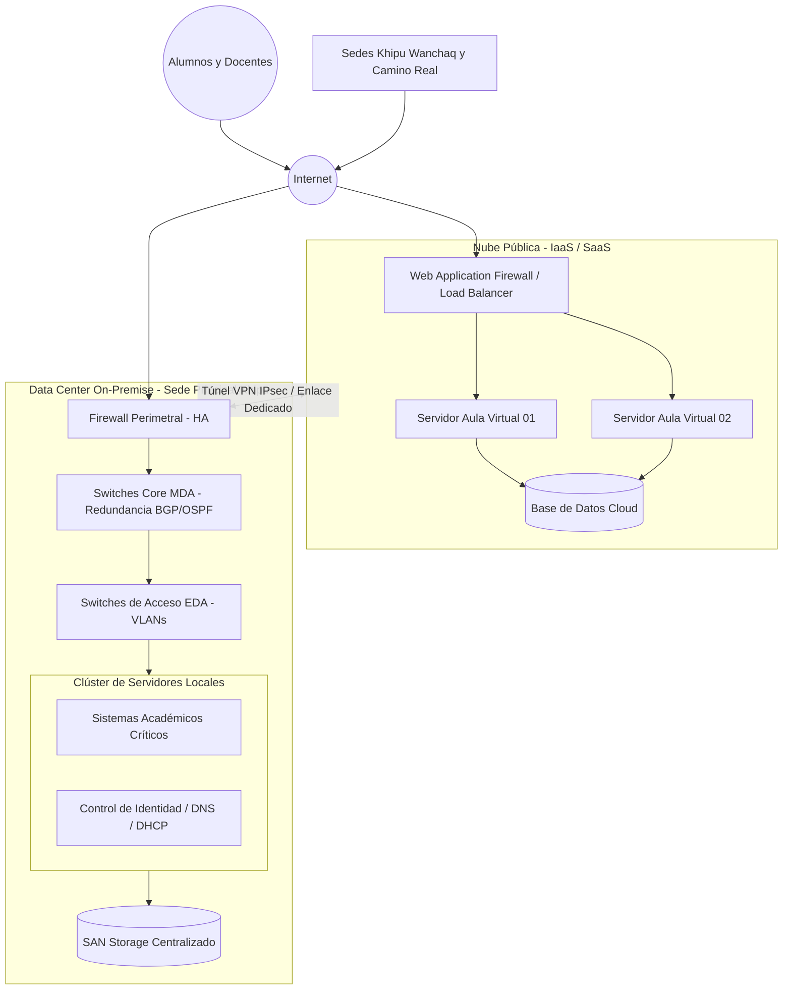

# test
test

```mermaid
graph TD
    %% Usuarios Externos
    Users((Alumnos y Docentes)) --> Internet((Internet))
    Sedes[Sedes Khipu Wanchaq y Camino Real] --> Internet
    
    %% Conexión hacia la Nube
    Internet --> WAF
    
    %% Zona Cloud
    subgraph Cloud [Nube Pública - IaaS / SaaS]
        WAF[Web Application Firewall / Load Balancer]
        Web1[Servidor Aula Virtual 01]
        Web2[Servidor Aula Virtual 02]
        DB_Cloud[(Base de Datos Cloud)]
        
        WAF --> Web1
        WAF --> Web2
        Web1 --> DB_Cloud
        Web2 --> DB_Cloud
    end
    
    %% Túnel Híbrido
    Cloud <--> |Túnel VPN IPsec / Enlace Dedicado| Firewall
    Internet --> Firewall
    
    %% Zona On-Premise
    subgraph OnPremise [Data Center On-Premise - Sede Principal Khipu]
        Firewall[Firewall Perimetral - HA]
        Core[Switches Core MDA - Redundancia BGP/OSPF]
        Acceso[Switches de Acceso EDA - VLANs]
        
        subgraph Virtualization [Clúster de Servidores Locales]
            App1[Sistemas Académicos Críticos]
            App2[Control de Identidad / DNS / DHCP]
        end
        
        SAN[(SAN Storage Centralizado)]
        
        Firewall --> Core
        Core --> Acceso
        Acceso --> Virtualization
        Virtualization --> SAN
    end
```
